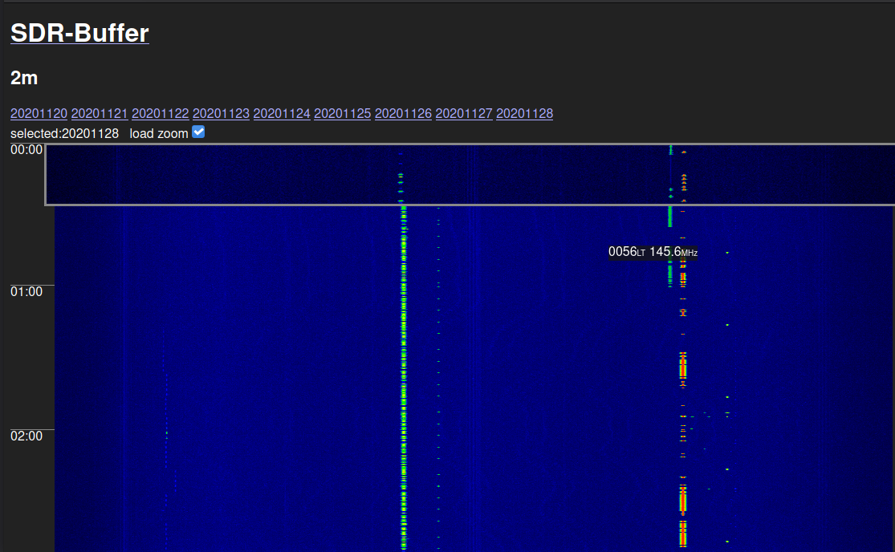
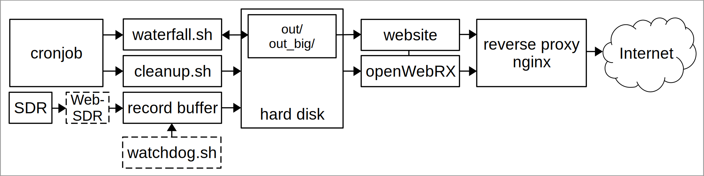

# SDR-Buffer	
Simple web based solution for
buffering SDR data for studying spectrum and searching for QRM 

**Example** https://websdr.iks.tugraz.at/sdrbuffer/

consists out of following components:

- start script
 	- start<band>.sh with loop.sh to be more robust  
	  record_buffer    	
	- watchdog.sh needs to be started seperately if required
- cronjobs
	- create waterfall (waterfall3)
	- cleanup
- web front end
	- displaying available data
	- starting and stopping openwebrx for replay
	- symlinks to waterfall data for each band
- openwebrx 
 (patched so that it listens to bash parameters instead of static config file)
- reverse proxy as entry point  (nginx)
	
the binary files and scripts are located in /opt/save

## record_buffer
(buffering data to disk, each minute one file)
simple C program 
for help use parameter 
> `--help` 
> 
input is stdin/pipe
watchdog creates file and keeps timestamp up to date to detect failures

**building** record buffer: 		
> gcc record_buffer4.c -o record_buffer

## watchdog.sh
watches for timestamp of file and kills pipe chain if needed

## downsample
based on waterfall tool from oe5dxl, will be published here:
https://github.com/oe5hpm/dxlAPRS 

## waterfall-x64
based on waterfall tool from oe5dxl, will be published here:
https://github.com/oe5hpm/dxlAPRS 

## web front end
simple php7 web page, also controlling the sessions of openwebrx and killing ghost sessions after 20min (/opt/save/www)

## reverse proxy
keeping the whole project in sub directories of an website to keep entrypoint compact (or to adapt to given limitations)

## copyright
**openwebrx** by HA7ILM [AGPL-3.0 License]

**waterfall3, downsample** as part of tools from OE5DXL  [GPL-2.0+]

other tools, scrips developed for this project are published under [GNU GPLv3]

## getting started
build and install csdr tools from https://github.com/oe2lsp/csdr (special version for simple_openwebrx, can be installed alonside with other versions of csdr without breaking)

several files need to be adopted for each band  
look for "80m" as reference
 
- crontab
- opt/save/cleanup.sh
- opt/save/start80m.sh
- opt/save/start.sh
- opt/save/watchdog.sh
- opt/save/www/index.php
- opt/save/www/function.php	

## TODO:
- documentation of used ports
- maybe adding some digi voice in websdr

**push requests welcome**
